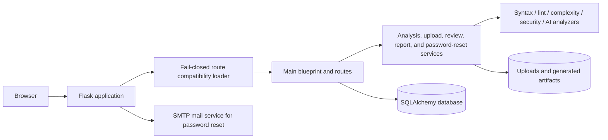

# Sentrix

<p align="center">
  
</p>

[](RELEASE_NOTES.md)
[](https://www.python.org/)
[](https://flask.palletsprojects.com/)
[](https://github.com/HaziqBinAfzal/HR-Presents-Sentrix/actions/workflows/ci.yml)

Sentrix is a Flask-based Python project analysis platform by **HR-Presents**. It accepts Python projects, performs syntax, lint, complexity, formatting, security, and optional AI-assisted analysis, stores project and analysis history, and generates report artifacts.

The permanent Sentrix identity uses the **Electric Spark Wing** across the application shell, favicon, social metadata, and self-contained generated reports.

## Core capabilities

- Registration, login, logout, password hashing, sessions, and user profiles
- Signed, expiring password-reset tokens with SMTP delivery
- Project upload and per-user project/analysis records
- Python syntax, Pylint, Bandit, Radon, formatting, and optional AI analysis modules
- Database-backed dashboard metrics and history queries
- Review model, forms, service references, and UI routes
- Self-contained branded HTML reports suitable for printing or saving as PDF
- Dockerfile, Docker Compose, Gunicorn, Nginx, environment configuration, and documentation
- GitHub Actions workflow definitions for Python validation and production image builds

## Password reset security

Password-reset links are signed with the application `SECRET_KEY`, expire after `PASSWORD_RESET_MAX_AGE` seconds, and include a fingerprint of the current password hash. A successful password change invalidates every previously issued reset link. The request response is deliberately generic to avoid revealing whether an email address is registered.

## Architecture



## Repository layout

```text
.
├── app.py
├── config.py
├── database.py
├── extensions.py
├── forms.py
├── models.py
├── analyzer/
│   └── routes/
│       ├── main.py
│       └── main_loader.py
├── helpers/
├── templates/
├── static/
├── migrations/
├── tests/
├── deploy/nginx/
├── Dockerfile
├── docker-compose.yml
├── gunicorn.conf.py
└── docs/
```

## Local installation

```bash
git clone https://github.com/HaziqBinAfzal/HR-Presents-Sentrix.git
cd HR-Presents-Sentrix
python -m venv .venv
```

Activate the environment, then:

```bash
pip install -r requirements.txt
cp .env.example .env
python app.py
```
