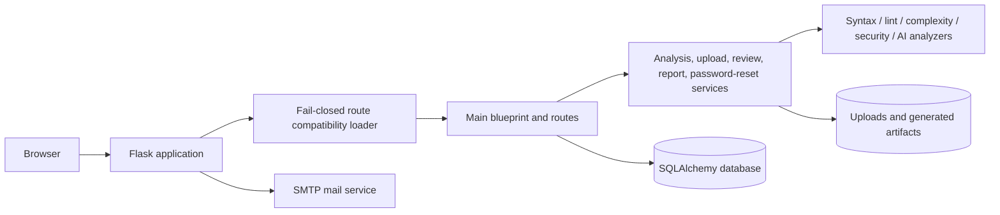

# Sentrix

[](RELEASE_NOTES.md)
[](https://www.python.org/)
[](https://flask.palletsprojects.com/)
[](https://github.com/HaziqBinAfzal/HR-Presents-Sentrix/actions/workflows/ci.yml)

Sentrix is a Flask-based Python project analysis platform by **HR-Presents**. It accepts Python projects, performs syntax, lint, complexity, formatting, security, and optional AI-assisted analysis, stores project and analysis history, and generates report artifacts.

> **Release status:** v1.0.0-RC1 remains a release candidate. Repository-level implementation is continuing on `agent/sentrix-v1-production-completion`. GitHub Actions is currently blocked before job creation by repository-level Actions permissions or policy; environment-dependent SMTP, HTTPS, backup/restore, scale, and clean-machine deployment checks must also be completed before production promotion.

## Verified repository capabilities

- Registration, login, logout, password hashing, sessions, and user profiles
- Signed, expiring password-reset tokens with SMTP delivery and one-time invalidation after password change
- Project upload and per-user project/analysis records
- Python syntax, Pylint, Bandit, Radon, formatting, and AI analysis modules
- Database-backed dashboard metrics and history queries
- Review model, forms, service references, and UI routes
- Dockerfile, Docker Compose, Gunicorn, Nginx, environment configuration, and documentation
- A fail-closed compatibility loader that removes only known malformed duplicate route blocks before application startup
- GitHub Actions workflow definitions for Python validation and a production image build; repository Actions policy must allow jobs to execute

## Production readiness matrix

| Area | Status | Evidence / remaining work |
|---|---|---|
| Application startup | Repaired, runtime test pending | `app.py` now imports the legacy routes through `main_loader.py`, which removes only exact known malformed duplicate blocks and fails closed if source markers change. |
| Authentication | Implemented | Registration, login/logout, password hashing and user-scoped records exist. |
| Email verification | Not implemented | SMTP is configured, but verification state, signed activation tokens, activation/resend routes, and templates are not yet present. |
| Forgot password | Implemented, SMTP test pending | Signed time-limited tokens, reset email delivery, invalid/expired handling, CSRF-protected forms, password update, and automatic token invalidation after password change are implemented. Real SMTP delivery still requires environment testing. |
| AI providers | Partial | OpenAI-oriented analysis exists. Gemini/Ollama switching, provider health checks, retries, and fallback behavior are not proven. |
| Report exports | Partial | Report storage/generation references exist. HTML, JSON, and PDF exports require route-level and artifact-level tests. |
| Dashboard metrics | Implemented, runtime test pending | Metrics query the database. The malformed duplicate dashboard block is removed at load time; route rendering still needs an executable CI or local smoke test. |
| Reviews | Implemented, test pending | Model, forms, services, and route references exist. Known malformed duplicate review handlers are removed at load time; CRUD authorization tests remain required. |
| Notifications | Not verified | No complete notification delivery workflow has been established. |
| Settings | Partial | UI/routes exist; persistence and validation need automated tests. |
| Uploads | Partial | `.py` and `.zip` validation and a 100 MB ceiling exist; archive traversal, duplicate, cleanup, nested-folder, and stress tests remain. |
| Migrations | Not verified | Migration commands must be exercised against fresh and upgrade databases. |
| Docker | Implemented, CI pending | Dockerfile and Compose are present; clean-machine Compose startup still needs verification. |
| Production deployment | Configured, environment pending | Gunicorn and Nginx examples exist; HTTPS, DNS, proxy headers, static files, and production secrets require a real deployment test. |
| GitHub Actions | Repository-policy blocked | Multiple runs fail before creating jobs or check runs, including after reducing the workflow to a conventional minimal configuration. The integration receives `403 Resource not accessible` when reading Actions permissions. |
| Security headers | Not verified | CSP, HSTS, frame, referrer, and related response headers require implementation/audit. |
| CSRF | Framework enabled | Flask-WTF provides CSRF for FlaskForm submissions; the new password-reset request and reset forms are protected. Every remaining manual POST endpoint/template must still be audited. |
| Authorization | Partially verified | Key analysis/project lookups use `current_user.id`; complete cross-user route tests remain required. |
| Error handling | Partial | Upload and missing-record handling plus 403/404/500 handlers exist; failure-path tests are still needed. |
| Performance | Not tested | Run 100 MB ZIP, 500/1,000-file, and concurrent-user tests outside CI. |
| Backup/restore | Documented, not tested | Restore a backup into a clean deployment and validate login, projects, analyses, and artifacts. |
| End-to-end flow | Not yet certified | Complete register → login → upload → analyze → recommendations → dashboard → report/export → history → logout testing. |

## Password reset security

Password-reset links are signed with the application `SECRET_KEY`, expire after `PASSWORD_RESET_MAX_AGE` seconds, and include a fingerprint of the current password hash. A successful password change invalidates every previously issued reset link. The request response is deliberately generic to avoid revealing whether an email address is registered.

## Architecture



## Repository layout

```text
.
├── app.py
├── config.py
├── database.py
├── extensions.py
├── forms.py
├── models.py
├── analyzer/
│   └── routes/
│       ├── main.py
│       └── main_loader.py
├── helpers/
│   └── password_reset.py
├── templates/
├── static/
├── migrations/
├── tests/
├── deploy/nginx/
├── Dockerfile
├── docker-compose.yml
├── gunicorn.conf.py
└── docs/
```

## Local installation

```bash
git clone https://github.com/HaziqBinAfzal/HR-Presents-Sentrix.git
cd HR-Presents-Sentrix
python -m venv .venv
```

Activate the environment, then:

```bash
pip install -r requirements.txt
cp .env.example .env
python app.py
```

Open `http://127.0.0.1:5000`.

## Environment variables

| Variable | Required | Purpose |
|---|---:|---|
| `SECRET_KEY` | Production | Session, CSRF, and password-reset token signing key |
| `DATABASE_URL` | Optional | SQLAlchemy URL; local SQLite is the default |
| `MAIL_SERVER` / `MAIL_PORT` | Email flows | SMTP endpoint |
| `MAIL_USERNAME` / `MAIL_PASSWORD` | Email flows | SMTP credentials |
| `MAIL_DEFAULT_SENDER` | Email flows | Sender identity |
| `PASSWORD_RESET_MAX_AGE` | Optional | Reset-token lifetime in seconds; default is 3600 |
| `OPENAI_API_KEY` | AI features | Optional AI credential |
| `APP_ENV` | Recommended | `development`, `testing`, or `production` |
| `MAX_CONTENT_LENGTH` | Optional | Upload ceiling in bytes; default is 100 MB |

## Production deployment

Do not use Flask's development server in production. The intended topology is:

```text
Internet -> HTTPS Nginx reverse proxy -> Gunicorn -> Sentrix -> database/storage/SMTP
```

```bash
gunicorn --config gunicorn.conf.py 'app:create_app()'
```

Use production secrets, secure cookies, TLS, restricted storage permissions, tested migrations, monitoring, and verified backups. See [docs/DEPLOYMENT.md](docs/DEPLOYMENT.md).

## Docker

```bash
docker compose build
docker compose up
```

The image definition is present. Compose service startup, persistence, uploads, networking, and recovery must still be tested on a clean machine before the release is promoted.

## v1.0 promotion gate

Sentrix should be tagged `v1.0.0` only after all of the following are true:

1. Repository Actions permissions allow CI jobs to run, and Python plus Docker checks pass.
2. The compatibility loader is replaced by a directly cleaned and tested route module before or shortly after v1.0.
3. Password reset passes real SMTP and browser-flow testing; email verification is implemented and tested or removed from the advertised feature set.
4. Every user-facing route and POST form has functional, CSRF, and authorization coverage.
5. HTML, JSON, and PDF exports are generated and validated.
6. Fresh-install and upgrade migrations succeed.
7. Docker Compose and Gunicorn/Nginx deployments pass clean-machine smoke tests.
8. HTTPS and security headers are validated.
9. Backup and restore produce a working application.
10. The full end-to-end workflow succeeds.
11. A deliberate license is added, or the repository is clearly marked proprietary.

## Documentation

- [Installation](docs/INSTALLATION.md)
- [User guide](docs/USER_GUIDE.md)
- [Administrator guide](docs/ADMIN_GUIDE.md)
- [Developer guide](docs/DEVELOPER_GUIDE.md)
- [API reference](docs/API.md)
- [Architecture](docs/ARCHITECTURE.md)
- [Deployment](docs/DEPLOYMENT.md)
- [Security](docs/SECURITY.md)
- [Troubleshooting](docs/TROUBLESHOOTING.md)
- [Contributing](CONTRIBUTING.md)
- [Roadmap](ROADMAP.md)
- [Release notes](RELEASE_NOTES.md)

## License and credits

Copyright © HR-Presents and contributors. No open-source license should be inferred until the repository owner adds the intended `LICENSE` text.

Sentrix is developed and maintained by HR-Presents.
