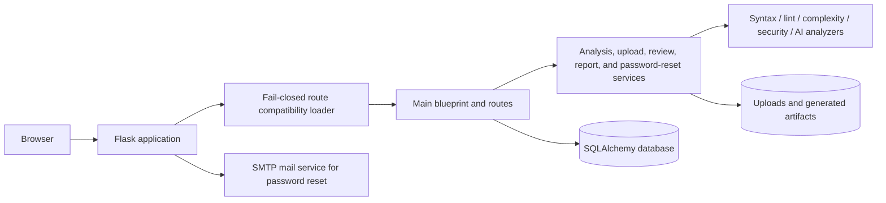

# Sentrix

[](RELEASE_NOTES.md)
[](https://www.python.org/)
[](https://flask.palletsprojects.com/)
[](https://github.com/HaziqBinAfzal/HR-Presents-Sentrix/actions/workflows/ci.yml)

Sentrix is a Flask-based Python project analysis platform by **HR-Presents**. It accepts Python projects, performs syntax, lint, complexity, formatting, security, and optional AI-assisted analysis, stores project and analysis history, and generates report artifacts.

## Core capabilities

- Registration, login, logout, password hashing, sessions, and user profiles
- Signed, expiring password-reset tokens with SMTP delivery
- Project upload and per-user project/analysis records
- Python syntax, Pylint, Bandit, Radon, formatting, and optional AI analysis modules
- Database-backed dashboard metrics and history queries
- Review model, forms, service references, and UI routes
- Dockerfile, Docker Compose, Gunicorn, Nginx, environment configuration, and documentation
- GitHub Actions workflow definitions for Python validation and production image builds

## Password reset security

Password-reset links are signed with the application `SECRET_KEY`, expire after `PASSWORD_RESET_MAX_AGE` seconds, and include a fingerprint of the current password hash. A successful password change invalidates every previously issued reset link. The request response is deliberately generic to avoid revealing whether an email address is registered.

## Architecture



## Repository layout

```text
.
├── app.py
├── config.py
├── database.py
├── extensions.py
├── forms.py
├── models.py
├── analyzer/
│   └── routes/
│       ├── main.py
│       └── main_loader.py
├── helpers/
├── templates/
├── static/
├── migrations/
├── tests/
├── deploy/nginx/
├── Dockerfile
├── docker-compose.yml
├── gunicorn.conf.py
└── docs/
```

## Local installation

```bash
git clone https://github.com/HaziqBinAfzal/HR-Presents-Sentrix.git
cd HR-Presents-Sentrix
python -m venv .venv
```

Activate the environment, then:

```bash
pip install -r requirements.txt
cp .env.example .env
python app.py
```

Open `http://127.0.0.1:5000`.

## Environment variables

| Variable | Required | Purpose |
|---|---:|---|
| `SECRET_KEY` | Production | Session, CSRF, and password-reset token signing key |
| `DATABASE_URL` | Optional | SQLAlchemy URL; local SQLite is the default |
| `MAIL_SERVER` / `MAIL_PORT` | Password reset | SMTP endpoint |
| `MAIL_USERNAME` / `MAIL_PASSWORD` | Password reset | SMTP credentials |
| `MAIL_DEFAULT_SENDER` | Password reset | Sender identity |
| `PASSWORD_RESET_MAX_AGE` | Optional | Reset-token lifetime in seconds; default is 3600 |
| `OPENAI_API_KEY` | AI features | Optional operator-managed AI credential |
| `APP_ENV` | Recommended | `development`, `testing`, or `production` |
| `MAX_CONTENT_LENGTH` | Optional | Upload ceiling in bytes; default is 100 MB |

## Production deployment

Do not use Flask's development server in production. The intended topology is:

```text
Internet -> HTTPS Nginx reverse proxy -> Gunicorn -> Sentrix -> database/storage/SMTP
```

```bash
gunicorn --config gunicorn.conf.py 'app:create_app()'
```

Use production secrets, secure cookies, TLS, restricted storage permissions, tested migrations, monitoring, and verified backups. See [docs/DEPLOYMENT.md](docs/DEPLOYMENT.md).

## Docker

```bash
docker compose build
docker compose up
```

## Documentation

- [Installation](docs/INSTALLATION.md)
- [User guide](docs/USER_GUIDE.md)
- [Administrator guide](docs/ADMIN_GUIDE.md)
- [Developer guide](docs/DEVELOPER_GUIDE.md)
- [API reference](docs/API.md)
- [Architecture](docs/ARCHITECTURE.md)
- [Deployment](docs/DEPLOYMENT.md)
- [Security](docs/SECURITY.md)
- [Troubleshooting](docs/TROUBLESHOOTING.md)
- [Contributing](CONTRIBUTING.md)
- [Roadmap](ROADMAP.md)
- [Release notes](RELEASE_NOTES.md)

## License and credits

Copyright © HR-Presents and contributors. No open-source license should be inferred until the repository owner adds the intended `LICENSE` text.

Sentrix is developed and maintained by HR-Presents.
