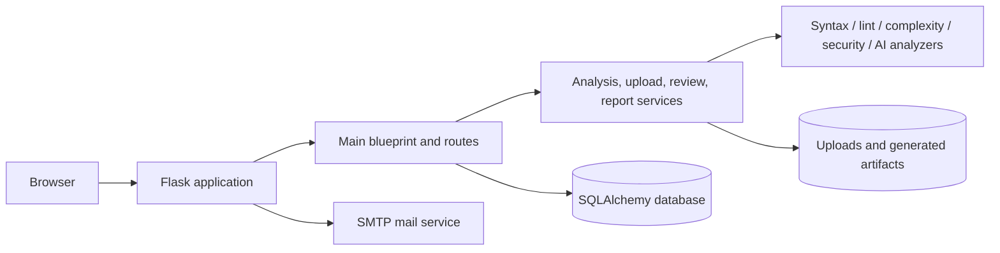

# Sentrix

[](RELEASE_NOTES.md)
[](https://www.python.org/)
[](https://flask.palletsprojects.com/)
[](LICENSE)

Sentrix is a Flask-based Python project analysis platform by **HR-Presents**. It accepts Python projects, performs syntax, lint, complexity, formatting, security, and AI-assisted analysis, stores project and analysis history, and generates downloadable reports.

> **Release status:** v1.0.0-RC1 is a release candidate. Complete the production checklist and environment-specific verification before exposing an installation to untrusted traffic.

## Core capabilities

| Area | Capability |
|---|---|
| Project intake | Upload and extract Python projects |
| Static analysis | Syntax checks, linting, complexity metrics, formatting observations |
| Security | Bandit-backed security findings and project-level review |
| AI assistance | Configurable AI recommendations where provider credentials are available |
| Workspace | Projects, analyses, results, reviews, history, profile, and settings |
| Reporting | Stored analysis records and generated report/export artifacts |
| Accounts | Registration, login, logout, password recovery, profile, and settings flows |

## Architecture



## Repository layout

```text
.
├── app.py                  # Application factory and entry point
├── config.py               # Environment-backed application configuration
├── database.py             # SQLAlchemy instance
├── extensions.py           # Flask extension instances
├── forms.py                # WTForms definitions
├── models.py               # Database models
├── analyzer/               # Analysis engines and primary blueprint
│   ├── routes/main.py
│   ├── syntax.py
│   ├── lint.py
│   ├── complexity.py
│   ├── security.py
│   └── ai.py
├── helpers/                # Upload, analysis, report, and review services
├── templates/              # Jinja templates
├── static/                 # Front-end assets
├── migrations/             # Database migrations, when present
├── tests/                  # Automated tests, when present
└── docs/                   # Product, operations, API, and contributor docs
```

## Technology stack

- Python 3.11 or newer recommended
- Flask, Flask-Login, Flask-SQLAlchemy, Flask-WTF, Flask-Mail
- SQLAlchemy and Alembic/Flask-Migrate
- Bandit, Flake8, Pylint, Radon, Black, and isort
- ReportLab for PDF-oriented report generation
- OpenAI SDK for optional AI-assisted recommendations
- Jinja, HTML, CSS, and JavaScript for the web interface

## Environment variables

Copy `.env.example` to `.env` and provide production-safe values.

| Variable | Required | Purpose |
|---|---:|---|
| `SECRET_KEY` | Yes in production | Flask session and CSRF signing key |
| `DATABASE_URL` | No | SQLAlchemy URL; defaults to local SQLite |
| `MAIL_USERNAME` | For email flows | SMTP username and default sender |
| `MAIL_PASSWORD` | For email flows | SMTP password or application password |
| `OPENAI_API_KEY` | For AI features | Optional AI provider credential |
| `FLASK_ENV` | No | Environment label; do not use development in production |

See [Installation](docs/INSTALLATION.md), [Deployment](docs/DEPLOYMENT.md), and [Security](docs/SECURITY.md) for complete guidance.

## Local installation

```bash
git clone https://github.com/HaziqBinAfzal/HR-Presents-Sentrix.git
cd HR-Presents-Sentrix
python -m venv .venv
```

Activate the environment, install dependencies, create `.env`, and run:

```bash
pip install -r requirements.txt
python app.py
```

Open `http://127.0.0.1:5000`.

Platform-specific activation and troubleshooting are documented in [docs/INSTALLATION.md](docs/INSTALLATION.md).

## Production deployment

Do not use Flask's development server for production. A typical topology is:

```text
Internet -> HTTPS reverse proxy (Nginx) -> Gunicorn -> Sentrix -> database/files/SMTP
```

Example Gunicorn command after adding Gunicorn to the production environment:

```bash
gunicorn --workers 3 --bind 127.0.0.1:8000 'app:create_app()'
```

Use a process supervisor, TLS certificates, restricted file permissions, an external database for multi-instance deployments, and tested backups. See [docs/DEPLOYMENT.md](docs/DEPLOYMENT.md).

## Docker status

RC1 documentation defines the intended Docker and Docker Compose workflow, but the repository must contain verified `Dockerfile` and Compose files before Docker deployment is declared complete. Track this in the [release checklist](RELEASE_NOTES.md).

## Documentation

- [User guide](docs/USER_GUIDE.md)
- [Administrator guide](docs/ADMIN_GUIDE.md)
- [Developer guide](docs/DEVELOPER_GUIDE.md)
- [API reference](docs/API.md)
- [Architecture](docs/ARCHITECTURE.md)
- [Deployment](docs/DEPLOYMENT.md)
- [Security](docs/SECURITY.md)
- [Troubleshooting](docs/TROUBLESHOOTING.md)
- [FAQ](docs/FAQ.md)
- [Contributing](CONTRIBUTING.md)
- [Roadmap](ROADMAP.md)
- [Changelog](CHANGELOG.md)
- [Release notes](RELEASE_NOTES.md)

## Quality and release verification

Before promoting RC1:

1. Install from a clean checkout on a supported Python version.
2. Run automated tests and static checks.
3. Exercise registration, login, password recovery, upload, analysis, history, reports, exports, profile, and settings.
4. Verify migrations against a copy of production data.
5. Verify SMTP, database, storage, reverse proxy, HTTPS, backups, and restore procedures.
6. Remove obsolete backup/save artifacts after confirming they are not needed.
7. Confirm debug mode is disabled and secrets are not committed.

## Contributing and security

Read [CONTRIBUTING.md](CONTRIBUTING.md) before opening changes. Report security vulnerabilities privately according to [SECURITY.md](SECURITY.md); do not disclose exploitable details in a public issue.

## License and credits

Copyright © HR-Presents and contributors. The repository owner must select and add the intended `LICENSE` text before public distribution is treated as licensed open-source software.

Sentrix is developed and maintained by HR-Presents. Third-party projects remain subject to their own licenses.
