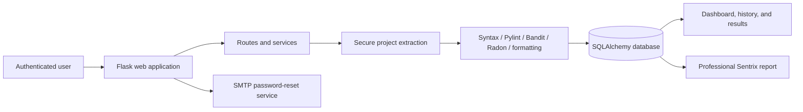

# Sentrix by HR-Presents

<p align="center">
  
</p>

<p align="center"><strong>Professional Python code quality, security, complexity, and reporting platform.</strong></p>

[](RELEASE_NOTES.md)
[](https://www.python.org/)
[](https://flask.palletsprojects.com/)
[](https://github.com/HaziqBinAfzal/HR-Presents-Sentrix/actions/workflows/ci.yml)

Sentrix is a Flask-based secure software analysis platform created and maintained by **HR-Presents**. Users can upload a Python file or ZIP project, run multiple analyzers, review results in a database-backed workspace, and generate professional technical reports.

The permanent production branch is:

```text
production/sentrix-permanent
```

## Current platform features

- Secure registration, login, logout, password hashing, sessions, password reset, and user profiles
- Per-user projects, analysis history, report access, and dashboard statistics
- Python syntax validation
- Pylint code-quality analysis
- Bandit security scanning
- Radon complexity analysis
- Formatting and structural inspection
- Optional operator-configured AI summaries and recommendations
- Project-specific security-controls and standards mapping
- Professional branded HTML reports suitable for browser review, printing, and PDF export
- Report evidence with scanner messages, rules, files, and line references when available
- Persistent light and dark themes across the application
- Responsive Sentrix interface using the Electric Spark Wing identity
- Docker, Docker Compose, Gunicorn, Nginx, environment configuration, and GitHub Actions support

## Professional report structure

Sentrix preserves a consistent report flow while enriching each section with technical and educational context:

1. Executive Summary
2. Score Overview
3. Project Profile and analysis methodology
4. Recommendations and remediation guidance
5. Quality Findings
6. Security Findings
7. Complexity Findings
8. Syntax and Structural Appendix

Reports explain what was analyzed, why the issue matters, how the scanner identified it, the likely technical and business impact, and how developers should remediate it.

### Standards and controls

When matching scanner evidence exists, Sentrix connects findings to relevant security guidance, including:

- OWASP Top 10 and OWASP ASVS
- CWE Top 25
- NIST SSDF, CSF, and SP 800-53 concepts
- CIS, SANS, and CERT secure-development practices
- ISO/IEC 27001 and ISO/IEC 27002
- SOC 2 security principles
- PCI DSS, GDPR, and HIPAA where applicable

These mappings are technical guidance and do not represent certification or legal advice.

## Analysis architecture



## Repository layout

```text
.
├── app.py                     # Application entry point
├── config.py                  # Environment-driven configuration
├── database.py                # Database compatibility export
├── extensions.py              # Flask extension instances
├── forms.py                   # Authentication and application forms
├── models.py                  # SQLAlchemy models
├── analyzer/                  # Analysis engines and routes
│   └── routes/
├── helpers/                   # Services, migrations, reporting, and utilities
├── templates/                 # Jinja application pages
├── static/                    # CSS and current Sentrix brand assets
├── migrations/                # Database migrations
├── tests/                     # Unit and security regression tests
├── deploy/nginx/              # Nginx deployment configuration
├── docs/                      # Operational and release documentation
├── Dockerfile
├── docker-compose.yml
├── gunicorn.conf.py
└── requirements.txt
```

## Local setup

Clone the repository and switch to the permanent production branch:

```bash
git clone https://github.com/HaziqBinAfzal/HR-Presents-Sentrix.git
cd HR-Presents-Sentrix
git fetch origin
git switch production/sentrix-permanent
```

Create and activate a virtual environment:

```bash
python -m venv venv
source venv/bin/activate
```

On Windows PowerShell:

```powershell
python -m venv venv
.\venv\Scripts\Activate.ps1
```

Install dependencies and configure the environment:

```bash
pip install -r requirements.txt
cp .env.example .env
```

Start the development server:

```bash
python app.py
```

Open:

```text
http://127.0.0.1:5000
```

## Validation

Compile the source tree:

```bash
python -m compileall -q app.py analyzer helpers forms.py models.py config.py tests
```

Run the complete test suite:

```bash
python -m unittest discover -s tests -v
```

## Production notes

- Never commit `.env`, database files, uploaded projects, generated reports, credentials, or private keys.
- Configure a strong `SECRET_KEY` in production.
- Use HTTPS and a reverse proxy such as Nginx.
- Store secrets in protected environment variables or a managed secret store.
- Validate SMTP, database, upload-size, and proxy settings before deployment.
- Generated reports contain analysis evidence and should be handled as confidential project artifacts.

## Developers

**Ruveeha Ashfaq**  
GitHub: [ruveeha33](https://github.com/ruveeha33)  
LinkedIn: [Ruveeha Ashfaq](https://www.linkedin.com/in/ruveeha-ashfaq-632b15378)

**Haziq Afzal**  
GitHub: [HaziqBinAfzal](https://github.com/HaziqBinAfzal)  
LinkedIn: [Haziq Afzal](https://www.linkedin.com/in/haziq-afzal-010b6636a)

## Documentation

- [Release notes](RELEASE_NOTES.md)
- [Changelog](CHANGELOG.md)
- [Security policy](SECURITY.md)
- [Contributing guide](CONTRIBUTING.md)
- [Code of conduct](CODE_OF_CONDUCT.md)
- [Roadmap](ROADMAP.md)

---

<p align="center">Sentrix · Presented by HR-Presents</p>
