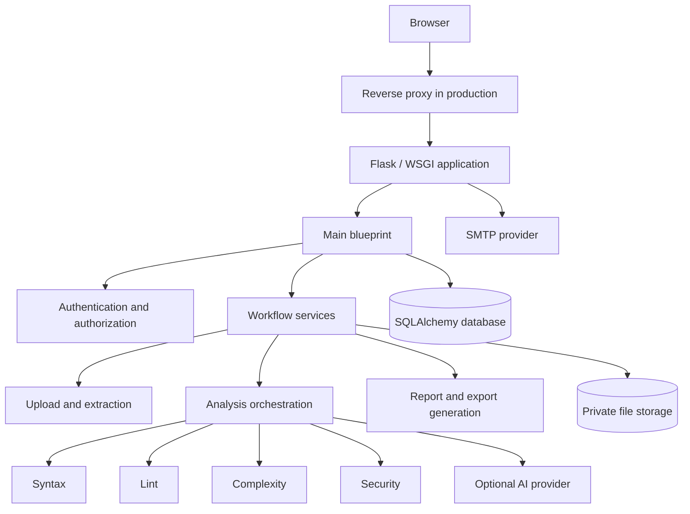

# Sentrix Architecture

## Overview

Sentrix is a modular Flask application organized around a single application factory, a primary blueprint, SQLAlchemy persistence, Jinja templates, analyzer modules, and service helpers.



## Components

### Application factory

`create_app()` configures Flask, mail, SQLAlchemy, Flask-Login, routes, and error handlers. Production deployment should import the factory through a WSGI server rather than execute the development server.

### Routing layer

`analyzer/routes/main.py` owns most user-facing workflows. This centralization is workable for an MVP but should gradually be split into authentication, projects, analyses, reports, profile, and settings blueprints as boundaries stabilize.

### Persistence

`models.py` contains database models. SQLAlchemy manages sessions and relationships. Every user-owned entity must be queried with ownership constraints. Alembic migrations should be the authoritative schema evolution mechanism.

### Analysis engines

Modules under `analyzer/` implement syntax, lint, formatting, complexity, security, extraction, and AI behavior. Analyzer output should be normalized into a stable internal finding model with source, rule, severity, confidence, file, line, message, and remediation fields.

### Services

`helpers/` coordinates uploads, analysis, reviews, and report generation. Services are the preferred place for transactions, filesystem operations, orchestration, and reusable domain rules.

### Presentation

Jinja templates and static assets render the SaaS interface. Shared navigation, cards, forms, messages, scripts, and styles should be centralized to prevent duplication and drift.

## Data flow

1. A user authenticates and submits a project.
2. The server validates the request and stores the upload privately.
3. Extraction validates archive paths and resource limits.
4. The pipeline discovers Python files and invokes analyzers.
5. Findings and status are stored in the database.
6. The user views results and may generate reports or exports.
7. Retention policies remove temporary and expired artifacts.

## Security boundaries

Untrusted boundaries include browser input, uploaded archives, extracted source code, analyzer tool output, AI-provider responses, SMTP, database contents, and generated documents. Each boundary requires validation, authorization, escaping, timeout/resource controls, and safe failure handling.

## Deployment topology

Recommended production topology:

```text
Client -> DNS/CDN (optional) -> Nginx/HTTPS -> Gunicorn workers -> Sentrix
                                                   |-> Database
                                                   |-> Private durable storage
                                                   |-> SMTP
                                                   |-> Optional AI provider
```

Horizontally scaled deployments require shared database and storage, stateless web workers, coordinated migrations, and an explicit strategy for long-running analysis jobs.

## Architectural risks in RC1

- A large route module increases coupling and regression risk.
- In-process analysis can consume web-worker time and memory.
- Local filesystem storage complicates horizontal scaling.
- Startup-time `db.create_all()` can mask missing migration discipline.
- Optional external AI and SMTP dependencies need timeouts and graceful degradation.
- Committed backup/save artifacts create maintenance ambiguity.

## Evolution path

Split domain blueprints, formalize service interfaces, normalize findings, add background job execution, introduce shared object storage where needed, publish a versioned API only after contract tests, and enforce architecture through tests and CI.
